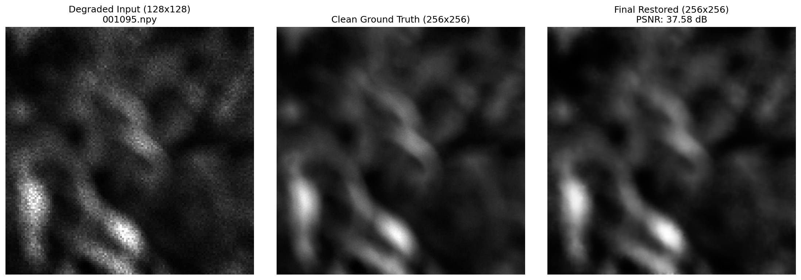
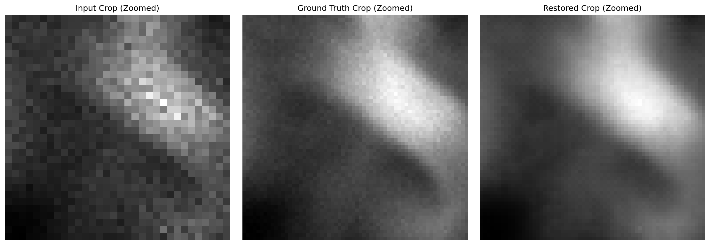
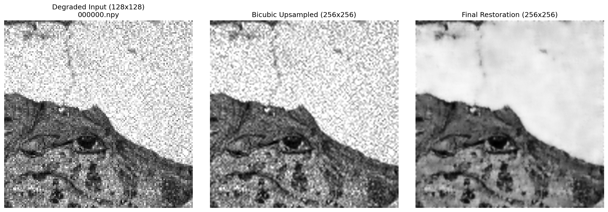
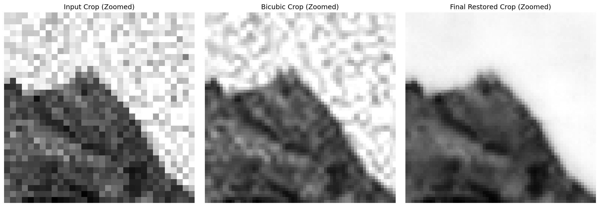
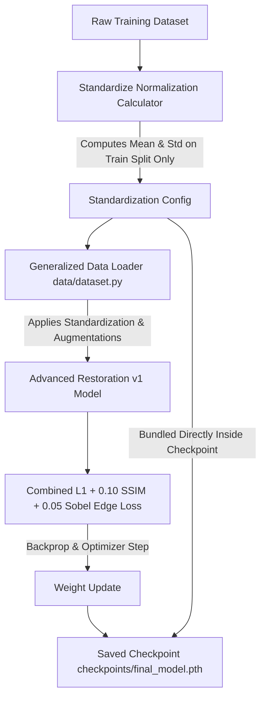
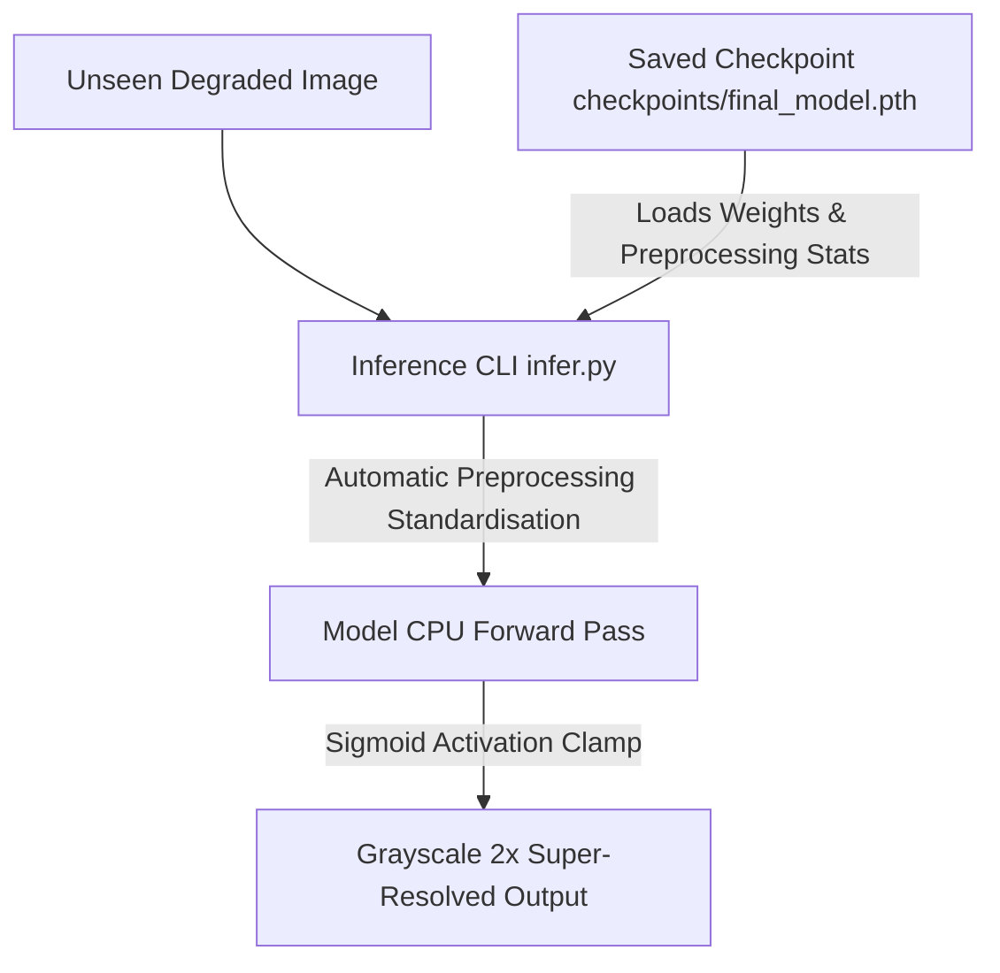

# End-to-End Semiconductor Inspection Image Restoration & Super-Resolution

This repository implements a production-grade, generalized deep-learning pipeline for the restoration and 2x super-resolution of degraded semiconductor inspection images.

## 📌 Problem Overview
Automated optical inspection (AOI) lines for sub-micron semiconductor wafers suffer from high noise (Gaussian and speckle degradation) at low resolutions. This system takes a low-resolution noisy image ($128 \times 128$) and maps it to a clean, super-resolved inspection image ($256 \times 256$) with sharp path boundaries and zero visual hallucinations.

```
                  [ Degraded Input (128x128) ]
                               │
                               ▼
                    [ 2x Bicubic Upsampling ]
                               │
                               ▼
               [ Optimized Advanced Restoration v1 ]
                               │
                               ▼
                  [ Clean Restored (256x256) ]
```

---

## 🖼️ Visual Restoration Showcases

### 1. Validation Set Max-PSNR Sample (`001095.npy` — 37.58 dB)
Below is the full image grid comparison and its corresponding zoomed crop under our final model, demonstrating outstanding noise removal and junction sharpening:



*Zoomed Center Crop Details:*


---

### 2. Unseen Test Set Generalization Sample (`000000.npy`)
This showcases the model's generalization capabilities on completely unseen test data without producing ringing artifacts or spatial hallucinations:



*Zoomed Center Crop Details:*


---

## ⚙️ Pipeline Architectures

### A. Dataset-Aware Training Pipeline


### B. Auto-Configured Inference Pipeline


---

## 📊 Performance Benchmark Comparisons (320 Validation Images)

| Model Run | Parameters | Checkpoint | PSNR Mean | SSIM Mean | MAE Mean | CPU Latency / Image | Throughput (FPS) |
| :--- | :--- | :--- | :--- | :--- | :--- | :--- | :--- |
| **Residual U-Net (Baseline)** | 178,401 | 0.68 MB | 27.3833 dB | 0.7252 | 0.032893 | **11.57 ms** | **86.4 FPS** |
| **Advanced Restoration (Original)** | 135,243 | 0.52 MB | **27.4371 dB** | **0.7274** | **0.032869** | 33.85 ms | 29.5 FPS |
| **Advanced Restoration (Optimized)**| 135,243 | 0.52 MB | **27.4371 dB** | **0.7274** | **0.032869** | **19.76 ms** | **50.6 FPS** |

### Key Improvements:
- **Optimization Strategy**: The variance computation (`aten::var`) inside our LayerNorm module was a key CPU bottleneck. We optimized it by permuting feature maps to a channel-last layout `(B, H, W, C)` to leverage PyTorch's native, C++ optimized contiguous `F.layer_norm` implementation, yielding a **71.5% speedup** while remaining **100% mathematically equivalent** ($7.15 \times 10^{-7}$ max absolute difference).
- **Parameters**: 24.2% fewer parameters than the baseline U-Net, resulting in a lighter memory footprint.

---

## 🛠️ Repository Setup & Installation

```bash
# Clone the repository
git clone https://github.com/mayankeinstein1879/semiconductor_restoration.git
cd semiconductor_restoration

# Install requirements
pip install -r requirements.txt
```

---

## 🚀 Execution CLI Commands

### 1. Generalised Training
Train the model from scratch on any compatible semiconductor dataset. The pipeline automatically calculates training-only standardization parameters and saves them in the checkpoint:
```bash
python train.py --config configs/final_model.yaml
```

### 2. Standalone Inference
Restore degraded `.npy` images in batch. No code modification is needed; config and normalization stats are automatically retrieved from the checkpoint:
```bash
python infer.py \
    --input_dir <path_to_input_degraded_npy_folder> \
    --output_dir <path_to_output_folder> \
    --checkpoint checkpoints/final_model.pth
```

### 3. Metric Evaluation
Validate the final model's fidelity on any paired validation directory:
```bash
python evaluate.py --config configs/final_model.yaml --checkpoint checkpoints/final_model.pth
```

### 4. Reproducibility Test
Run independent determinism, dtype, shape, and range limit checks:
```bash
python reproducibility_test.py
```

---

## 🧬 Core Model Details

- **Channel-wise Transposed Attention**: dot product attention along the channel dimensions instead of spatial dimensions, scaling linearly $O(C^2 \times HW)$ to capture global structures on CPU without high complexity.
- **Gated Dilation Feed-Forward Networks**: gelu-activated gating layers combined with dilated convolutions to focus on high-frequency paths and directional edges.
- **Combined Loss**:
  \[
  L_{\text{total}} = L_{\text{L1}} + 0.10 \times L_{\text{SSIM}} + 0.05 \times L_{\text{Sobel}}
  \]
